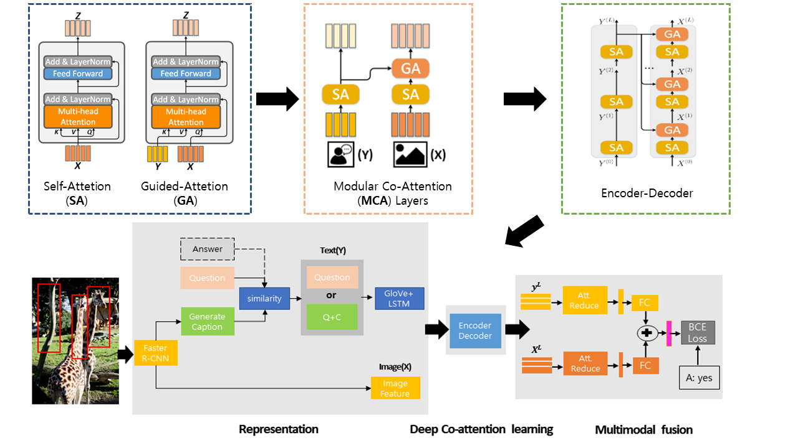

# Deep Modular Co-Attention Networks with Similar Caption (MCAN-Cap)

MCAN-Cap is a modified model of [MCAN](https://github.com/MILVLG/mcan-vqa) that uses only similar image caption. With similar generated captions without stopword, we achieved an overall accuracy **67.41%** on *val* splits. 

By using the commonly used bottom-up-attention visual features, a single MCAN model delivers **67.20%** (small model) overall accuracy on the *val* split of *VQA-v2* dataset. Please check our [paper](http://) for details.




## Table of Contents
0. [Prerequisites](#Prerequisites)
0. [Training](#Training)
0. [Validation and Testing](#Validation-and-Testing)
0. [Model Zoo](#Performance)


## Prerequisites
#### Generate image caption
We use pretrained [standard transformer model (Up-Down + Transformer)](https://github.com/yahoo/object_relation_transformer) to generate image captions.

You can use generated captions at `datasets/caption`, `vis_cap_trainval` is captions for *train+val* datasets and `vis_cap_test` is captions for *test* dataset.

You can calculate similarity with question and caption (or Q+A pair and caption) by using `cal_sim.py`. Then, you can set threshold and make text pharse(Q or Q+C) files by using `make_sim.py`.  

#### Software and Hardware Requirements and Setup 
For most setup and prerequets, refer to [MCAN](https://github.com/MILVLG/mcan-vqa).

Finally, the `datasets` folders will have the following structure:

```angular2html
|-- datasets
	|-- coco_extract
	|  |-- train2014
	|  |  |-- COCO_train2014_...jpg.npz
	|  |  |-- ...
	|  |-- val2014
	|  |  |-- COCO_val2014_...jpg.npz
	|  |  |-- ...
	|  |-- test2015
	|  |  |-- COCO_test2015_...jpg.npz
	|  |  |-- ...
	|-- vqa
	|  |-- v2_OpenEnded_mscoco_train2014_questions.json
	|  |-- v2_OpenEnded_mscoco_val2014_questions.json
	|  |-- v2_OpenEnded_mscoco_test2015_questions.json
	|  |-- v2_OpenEnded_mscoco_test-dev2015_questions.json
	|  |-- v2_mscoco_train2014_annotations.json
	|  |-- v2_mscoco_val2014_annotations.json
	|  |-- VG_questions.json
	|  |-- VG_annotations.json
	|-- caption
	|  |--0.60 (Threshold that you want)
	|  |--0.61
	|  |--...
	|  |--0.99

```


## Training

The following script will start training with the default hyperparameters:

```bash
$ python3 run.py --RUN='train'
```
All checkpoint files will be saved to:

```
ckpts/ckpt_<VERSION>/epoch<EPOCH_NUMBER>.pkl
```

and the training log file will be placed at:

```
results/log/log_run_<VERSION>.txt
```

To add：

1. ```--VERSION=str```, e.g.```--VERSION='small_model'``` to assign a name for your this model.

2. ```--GPU=str```, e.g.```--GPU='2'``` to train the model on specified GPU device.

3. ```--NW=int```, e.g.```--NW=8``` to accelerate I/O speed.

4. ```--MODEL={'small', 'large'}```  ( Warning: The large model will consume more GPU memory, maybe [Multi-GPU Training and Gradient Accumulation](#Multi-GPU-Training-and-Gradient-Accumulation) can help if you want to train the model with limited GPU memory.)

5. ```--SPLIT={'train', 'train+val', 'train+val+vg'}``` can combine the training datasets as you want. The default training split is ```'train+val+vg'```.  Setting ```--SPLIT='train'```  will trigger the evaluation script to run the validation score after every epoch automatically.

6. ```--RESUME=True``` to start training with saved checkpoint parameters. In this stage, you should assign the checkpoint version```--CKPT_V=str``` and the resumed epoch number ```CKPT_E=int```.

7. ```--MAX_EPOCH=int``` to stop training at a specified epoch number.

8. ```--PRELOAD=True``` to pre-load all the image features into memory during the initialization stage (Warning: needs extra 25~30GB memory and 30min loading time from an HDD drive).

9. ```--MAX_TOKEN=int``` to set using token number. I recommand 10 to 20 tokens(too many or fewer tokens doesn`t work well).

####  Multi-GPU Training and Gradient Accumulation

We recommend to use the GPU with at least 8 GB memory, but if you don't have such device, don't worry, we provide two ways to deal with it:

1. _Multi-GPU Training_: 

    If you want to accelerate training or train the model on a device with limited GPU memory, you can use more than one GPUs:

	Add ```--GPU='0, 1, 2, 3...'```

    The batch size on each GPU will be adjusted to `BATCH_SIZE`/#GPUs automatically.

2. _Gradient Accumulation_: 

    If you only have one GPU less than 8GB, an alternative strategy is provided to use the gradient accumulation during training:
	
	Add ```--ACCU=n```  
	
    This makes the optimizer accumulate gradients for`n` small batches and update the model weights at once. It is worth noting that  `BATCH_SIZE` must be divided by ```n``` to run this mode correctly. 


## Validation and Testing

**Warning**: If you train the model use ```--MODEL``` args or multi-gpu training, it should be also set in evaluation.


#### Offline Evaluation

Offline evaluation only support the VQA 2.0 *val* split. If you want to evaluate on the VQA 2.0 *test-dev* or *test-std* split, please see [Online Evaluation](#Online-Evaluation).

There are two ways to start:

(Recommend)

```bash
$ python3 run.py --RUN='val' --CKPT_V=str --CKPT_E=int
```

or use the absolute path instead:

```bash
$ python3 run.py --RUN='val' --CKPT_PATH=str
```


#### Online Evaluation

The evaluations of both the VQA 2.0 *test-dev* and *test-std* splits are run as follows:

```bash
$ python3 run.py --RUN='test' --CKPT_V=str --CKPT_E=int
```

Result files are stored in ```results/result_test/result_run_<'PATH+random number' or 'VERSION+EPOCH'>.json```

You can upload the obtained result json file to [Eval AI](https://evalai.cloudcv.org/web/challenges/challenge-page/163/overview) to evaluate the scores on *test-dev* and *test-std* splits.


## Model Zoo
The performance of the model on *val* split is reported as follows:

_Model_ | Overall | Yes/No | Number | Other
:-: | :-: | :-: | :-: | :-:
_mcan_ | 67.2 | **84.83** | 48.52 | 58.69| 
_mcan_all_caption_ | 67.32 | 84.44 | 50.00 | 58.84| 
_mcan_cap_ | **67.41**| 84.71 | **50.04** | **58.85**|

When using similar captions with Answer and Question pairs, *overall* performance increased to **68.19**.
